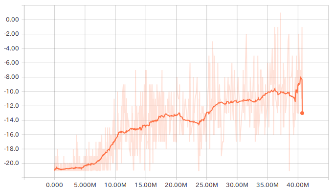
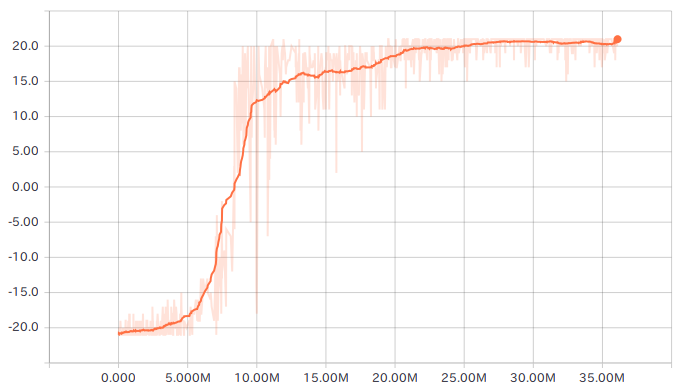

# Asynchronous-Advantage-Actor-Critic-TensorFlow

## Update
Bug fixed
```
/home/jack/Applications/pythonEnv/python3/bin/python /home/jack/Applications/async_deep_reinforce/a3c.py
Traceback (most recent call last):
  File "/home/jack/Applications/async_deep_reinforce/a3c.py", line 50, in <module>
    global_network = GameACLSTMNetwork(ACTION_SIZE, -1, device)
  File "/home/jack/Applications/async_deep_reinforce/game_ac_network.py", line 218, in __init__
    self.W_lstm = tf.get_variable("basic_lstm_cell/weights")
  File "/home/jack/Applications/pythonEnv/python3/lib/python3.5/site-packages/tensorflow/python/ops/variable_scope.py", line 1065, in get_variable
    use_resource=use_resource, custom_getter=custom_getter)
  File "/home/jack/Applications/pythonEnv/python3/lib/python3.5/site-packages/tensorflow/python/ops/variable_scope.py", line 962, in get_variable
    use_resource=use_resource, custom_getter=custom_getter)
  File "/home/jack/Applications/pythonEnv/python3/lib/python3.5/site-packages/tensorflow/python/ops/variable_scope.py", line 367, in get_variable
    validate_shape=validate_shape, use_resource=use_resource)
  File "/home/jack/Applications/pythonEnv/python3/lib/python3.5/site-packages/tensorflow/python/ops/variable_scope.py", line 352, in _true_getter
    use_resource=use_resource)
  File "/home/jack/Applications/pythonEnv/python3/lib/python3.5/site-packages/tensorflow/python/ops/variable_scope.py", line 682, in _get_single_variable
    "VarScope?" % name)
ValueError: Variable net_-1/basic_lstm_cell/weights does not exist, or was not created with tf.get_variable(). Did you mean to set reuse=None in VarScope?
```
## Citation
```
@inproceedings{mnih2016asynchronous,
  title={Asynchronous methods for deep reinforcement learning},
  author={Mnih, Volodymyr and Badia, Adria Puigdomenech and Mirza, Mehdi and Graves, Alex and Lillicrap, Timothy and Harley, Tim and Silver, David and Kavukcuoglu, Koray},
  booktitle={International Conference on Machine Learning},
  pages={1928--1937},
  year={2016}
}
```
## About

An attempt to reproduce Google DeepMind's paper "Asynchronous Methods for Deep Reinforcement Learning."

http://arxiv.org/abs/1602.01783

Asynchronous Advantage Actor-Critic (A3C) method for playing "Atari Pong" is implemented with TensorFlow.
Both A3C-FF and A3C-LSTM are implemented.

Learning result after 26 hours (A3C-FF) is like this.

[](https://youtu.be/ZU71YdAedZs)

Any advice or suggestion is strongly welcomed in issues thread.

https://github.com/JiankaiSun-SJTU-MVIG-training/async_deep_reinforce/issues/1

## How to build

First we need to build multi thread ready version of Arcade Learning Enviroment.
I made some modification to it to run it on multi thread enviroment.

    $ git clone https://github.com/miyosuda/Arcade-Learning-Environment.git
    $ cd Arcade-Learning-Environment
    $ cmake -DUSE_SDL=ON -DUSE_RLGLUE=OFF -DBUILD_EXAMPLES=OFF .
    $ make -j 4
	
    $ pip install .

I recommend to install it on VirtualEnv environment.

## How to run

To train,

    $python a3c.py

To display the result with game play,

    $python a3c_disp.py

## Using GPU
To enable gpu, change "USE_GPU" flag in "constants.py".

When running with 8 parallel game environemts, speeds of GPU (GTX980Ti) and CPU(Core i7 6700) were like this. (Recorded with LOCAL_T_MAX=20 setting.)

|type | A3C-FF             |A3C-LSTM          |
|-----|--------------------|------------------|
| GPU | 1722 steps per sec |864 steps per sec |
| CPU | 1077 steps per sec |540 steps per sec |


## Result
Score plots of local threads of pong were like these. (with GTX980Ti)

### A3C-LSTM LOCAL_T_MAX = 5



### A3C-LSTM LOCAL_T_MAX = 20



Scores are not averaged using global network unlike the original paper.

## Requirements
- TensorFlow 1.3
- numpy '1.13.1'
- cv2 '3.3.0'
- matplotlib '2.0.2'

## References

This project uses setting written in muupan's wiki [muuupan/async-rl] (https://github.com/muupan/async-rl/wiki)


## Acknowledgements

- [@aravindsrinivas](https://github.com/aravindsrinivas) for providing information for some of the hyper parameters.
- [jsalvatier/async_deep_reinforce](https://github.com/jsalvatier/async_deep_reinforce)
- [miyosuda/async_deep_reinforce](https://github.com/miyosuda/async_deep_reinforce)
